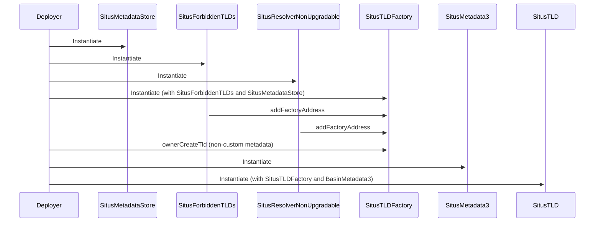
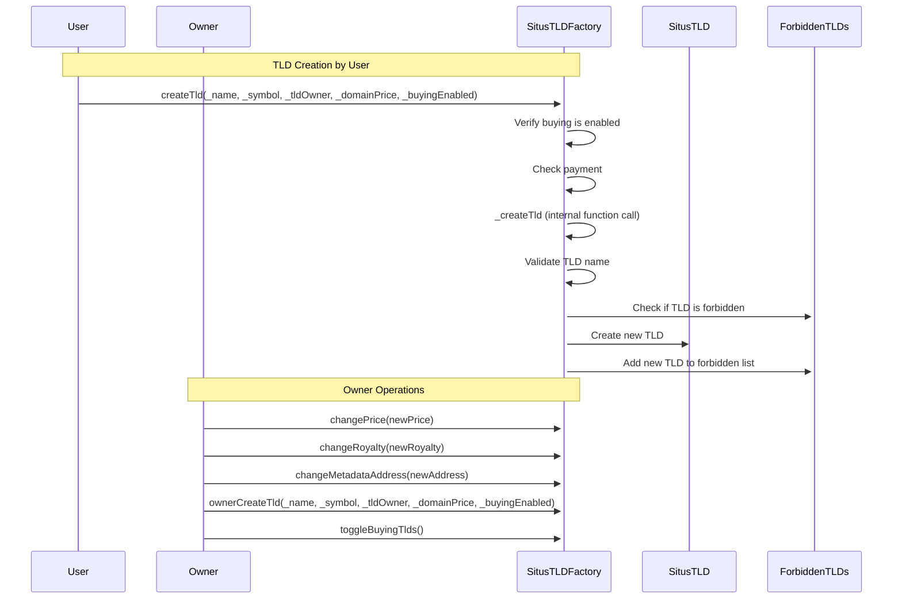
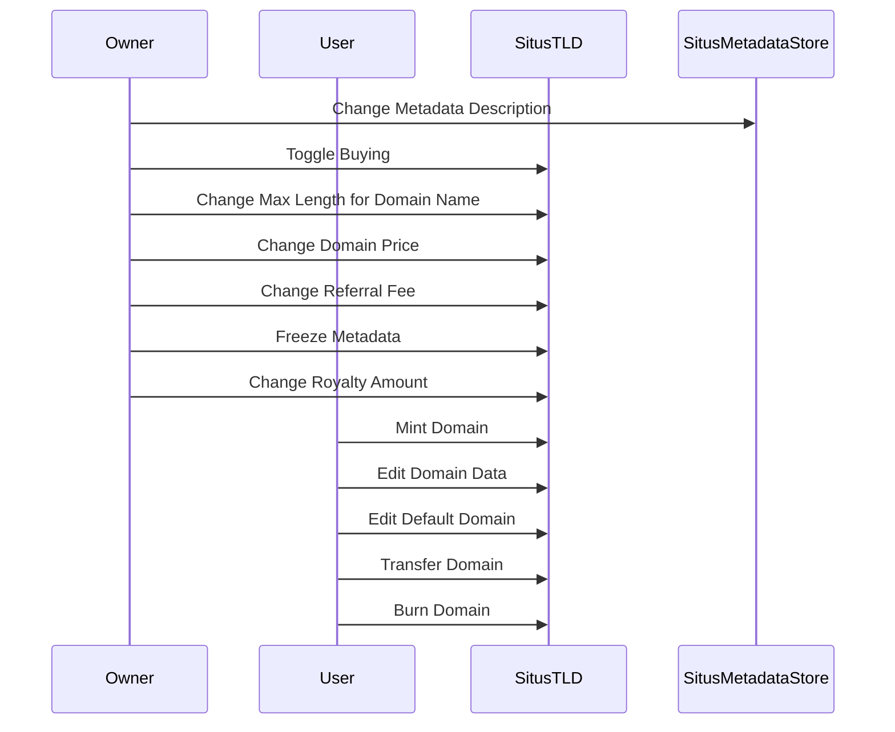

# Situs Protocol Core Contracts

Contracts to create a top-level domain (TLD) such as `.basin`



## SitusTLDFactory


## SitusTLD

If buying is disabled, owner, but not users can mint.

## Set up .env

```bash
cp .env.sample .env
```
add PRIVATE_KEY (default) or MNEMONIC
add BASESCAN_API_KEY

## Install Dependencies

```bash
npm install
```

## Compile Typechain Artifacts

```bash
npm run build
```

## Run Tests

```bash
npm run test
```

## Lint both Solidity and Typescript Files

```bash
npm run lint
```

## Format both Solidity and Typescript Files

```bash
npm run fmt
```

## Deploy Contracts to Hardhat

Deploy to in-process instance of Hardhat Network, results will be lost.
```bash
npm run deploy hardhat
```

## Deploy Contracts to Local node
Start local network
```bash
npx hardhat node
```

Start a new terminal and execute:
```bash
npm run deploy localhost
```

## Add Base Sepolia to Metamask

- Name	Sepolia
- Network Name	Base Sepolia
- RPC Endpoint	https://sepolia.base.org
- Chain ID	84532
- Currency Symbol	ETH
- Block Explorer	https://sepolia-explorer.base.org

## TODO
- Write Hardhat tests
- Write deployment scripts
- Deploy to Localhost
- Deploy to Base Sepolia
- Verify Sepolia contracts https://hardhat.org/ignition/docs/guides/verify
- Point frontend to Base Sepolia for testing
- Deploy to Zora Sepolia Testnet? https://testnet.zora.co/
- Deploy to Base Mainnet
- Verify mainnet contracts https://hardhat.org/ignition/docs/guides/verify
- Point Frontend to Base Mainnet

## References

- Adapted from the Flexi contracts in [punk-contracts repo](https://github.com/punk-domains-2/punk-contracts) by @tempe-techie and @johnson86tw

---
---
# Original README below

# Punk Domains core contracts

Punk Domains allow anyone to either create a top-level domain (TLD) such as `.wagmi` or a normal domain such as `techie.wagmi`. In addition, users can add some other data to their domain:

- description
- redirect URL (useful together with the Punk Domains browser extension)
- profile picture (an address and token ID of an NFT)

### Verify TLD contracts

Verifying TLD contracts generated through the factory is a bit tricky, but there is a way around the issue. See `scripts/temp/deployTld.js` for instructions.

#### Manually verify TLD contract on Etherscan

1. Flatten the code (`npx hardhat flatten <path-to-contract>.sol >> <flat-contract-name>.sol`).
2. Delete all instances of SPDX Licences except one.
3. Go to Etherscan and select single file verification.
4. Turn on optimizations.
5. Select 0.8.4 for compiler (do not delete other pragma solidity lines in the file, even if they are for a different Solidity version).
6. Generate the ABI-encoded constructor arguments using this online tool: https://abi.hashex.org/. Make sure you generate all arguments 
needed in the TLD **constructor**, including the Factory address.
7. Submit for verification and hope for the best :)

## Audit tools

### Flatten the contracts

Most audit tools will require you to flatten the contracts. This means that all contracts that are defined under the imports will actually be imported into one .sol file, so all code is in one place.

First create a new folder called flattened:

```bash
mkdir flattened
```

To flatten a contract, run this command:

```bash
npx hardhat flatten <path-to-contract> >> flattened/<flat-contract-name>.sol
```

You may also need to give all contracts in the flattened file the same Solidity version. And you may need to delete all SPDX lines except the very first one.

### Mythril

Use Docker:

```bash
sudo docker pull mythril/myth
```

Go to the `flattened` folder and run this command:

```bash
sudo docker run -v $(pwd):/tmp mythril/myth -v4 analyze /tmp/<flat-contract-name>.sol --max-depth 10
```

Or, if you don't use Docker, use this command alone:

```bash
myth -v4 analyze flattened/PunkForbiddenTlds.sol --max-depth 10
```

Flags:

- `v4`: verbose
- `o`: output
- `a`: address onchain
- `l`: automatically retrieve dependencies
- `max-depth`: maximum recursion depth

Docs: https://mythril-classic.readthedocs.io/en/master/security-analysis.html 

### Slither

Install Slither:

```bash
pip3 install slither-analyzer --user
```

Run it in the `flattened` folder:

```bash
slither .
```

Docs: https://github.com/crytic/slither

## Debugging

### Error: ENOENT: no such file or directory

Run `npx hardhat clean` and then `npx hardhat compile`.